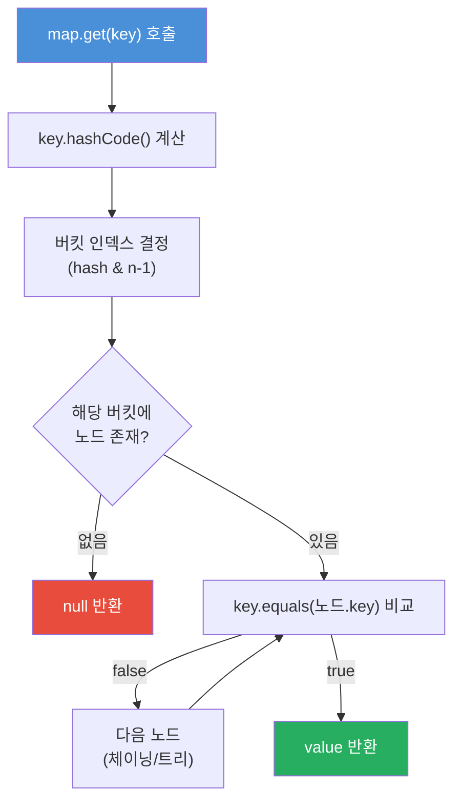

# == vs equals() 와 hashCode()

## 핵심 개념

**== 연산자**는 참조(주소) 비교, **equals() 메서드**는 논리적 동등성 비교다. equals()를 오버라이드하면 반드시 hashCode()도 함께 오버라이드해야 하며, 이를 어기면 HashMap 등 해시 기반 컬렉션에서 오동작한다.

## 동작 원리

### == 연산자

두 참조 변수가 **같은 객체(같은 메모리 주소)**를 가리키는지 비교한다.

```java
String a = new String("hello");
String b = new String("hello");

System.out.println(a == b);       // false — 서로 다른 객체
System.out.println(a.equals(b));  // true  — 값이 같음
```

```
Heap:
  0x100: "hello"  ← a가 참조
  0x200: "hello"  ← b가 참조
  a == b → 0x100 != 0x200 → false
```

기본 타입(primitive)에서는 **값 자체**를 비교한다:
```java
int x = 5;
int y = 5;
System.out.println(x == y);  // true — 값 비교
```

### equals() 메서드

Object 클래스의 기본 구현은 `==`과 동일하다. 논리적 동등성 비교를 위해 **오버라이드**해야 한다.

```java
// Object의 기본 구현 (OpenJDK)
public boolean equals(Object obj) {
    return (this == obj);  // 참조 비교와 동일
}

// 오버라이드 예시 — 논리적 동등성 비교
public class User {
    private String name;
    private int age;

    @Override
    public boolean equals(Object o) {
        if (this == o) return true;
        if (o == null || getClass() != o.getClass()) return false;
        User user = (User) o;
        return age == user.age && Objects.equals(name, user.name);
    }
}
```

### hashCode() — equals()와 반드시 함께 오버라이드

**계약**: `equals()`가 true인 두 객체는 반드시 **같은 hashCode()**를 반환해야 한다.

#### HashMap 버킷 탐색 흐름



hashCode는 "어느 서랍을 열지" 결정하고, equals는 "서랍 안에서 진짜 맞는 물건인지" 확인한다.

#### equals()만 오버라이드하고 hashCode()를 안 하면:

```java
User u1 = new User("홍길동", 25);
User u2 = new User("홍길동", 25);

u1.equals(u2);  // true — equals 오버라이드했으니까

Map<User, String> map = new HashMap<>();
map.put(u1, "데이터");
map.get(u2);  // null! — hashCode가 달라서 다른 버킷을 탐색
```

```
u1.hashCode() → 버킷 3  ← put은 여기에 저장
u2.hashCode() → 버킷 7  ← get은 여기서 찾음 → 못 찾음!
```

```java
// 올바른 구현 — equals()와 hashCode() 함께 오버라이드
@Override
public int hashCode() {
    return Objects.hash(name, age);  // equals에서 사용한 같은 필드로 계산
}
```

### hashCode 계약 정리

| 규칙 | 설명 |
|------|------|
| `equals()가 true` → `hashCode()` 같아야 함 | **필수** — 위반 시 HashMap 오동작 |
| `hashCode()` 같음 → `equals()가 true`일 필요 없음 | 해시 충돌은 허용됨 |
| `equals()가 false` → `hashCode()` 달라야 할 필요 없음 | 다르면 성능에 유리할 뿐 |

## Objects 유틸리티 (Java 7+)

```java
// null-safe 비교
Objects.equals(a, b);
// 내부: (a == b) || (a != null && a.equals(b))

// 여러 필드 조합 hashCode 계산
Objects.hash(name, age, email);
```

## 어떤 필드를 equals/hashCode에 포함해야 하는가

| 포함 권장 | 제외 권장 |
|-----------|-----------|
| 논리적 동등성을 결정하는 불변 필드 | JPA @GeneratedValue id |
| 비즈니스 키 (이메일, 주문번호 등) | 생성 후 변경되는 가변 필드 |
| 카디널리티 높은 필드 (성능 우선) | 양방향 연관 관계 필드 (순환 참조 위험) |

## JPA 엔터티에서의 주의사항

JPA 엔터티는 persist 전(id=null) → 후(id=1L)로 id가 변경된다. Lombok `@EqualsAndHashCode`를 무설정으로 사용하면 HashSet 삽입 후 persist 시점에 hashCode가 달라져 객체를 찾지 못하는 유령 객체 문제가 발생한다.

```java
// 잘못된 패턴
@Entity
@EqualsAndHashCode  // 모든 필드 포함 → id 변경 시 hashCode 변경
public class Member {
    @Id @GeneratedValue
    private Long id;
    private String email;
}

// 권장 패턴 — 불변 비즈니스 키만 포함
@EqualsAndHashCode(of = {"email"})
public class Member { ... }
```

## 안티패턴

**1. hashCode를 상수로 반환** — 계약 위반은 아니지만 모든 객체가 한 버킷에 쌓여
HashMap이 O(1) → O(N) 연결 리스트로 퇴화 (Java 8+: O(log N) 부분 회복)

**2. equals와 다른 필드 집합으로 hashCode 계산** — 계약 위반;
`equals=true`인데 `hashCode`가 다를 수 있음

**3. 가변 필드(mutable field)를 hashCode에 포함** — 삽입 후 필드 변경 시
HashSet 안에서 객체를 찾지 못하는 유령 객체 + 메모리 누수

## Java 16+ Record

```java
record Point(int x, int y) {}  // equals/hashCode/toString 컴파일러 자동 생성
```

불변 VO에는 record 사용을 권장한다.

## 관련 문서

- [[HashMap-HashTable-ConcurrentHashMap]]
- [[Collections-Framework]]
- [[Immutable-Object]]
- [[String-심화]] — String의 hashCode 캐싱
